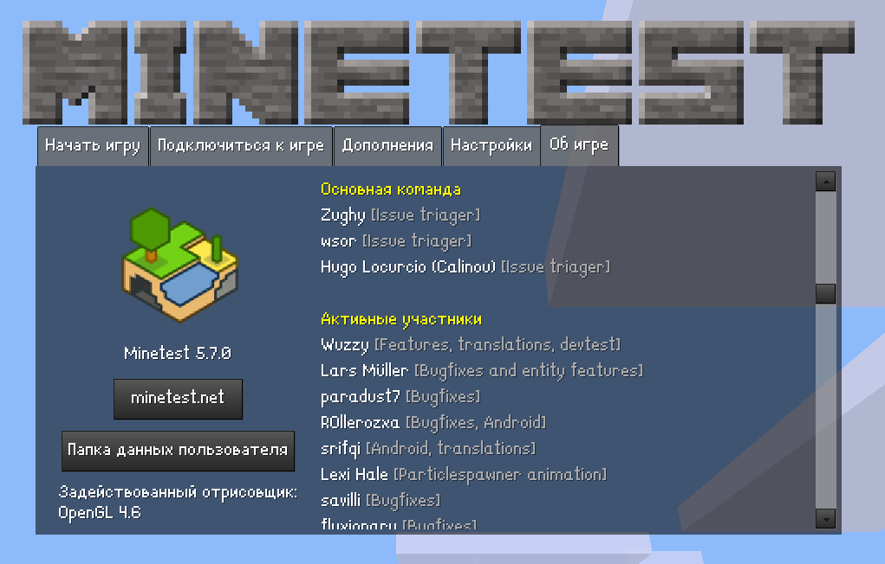

# Pixel Fonts

This mod installs or removes multilingual pixel fonts: [LanaPixel] (default) and
[Monogram] (monospace, for the console). Both fonts are distributed under a free
license, just like this mod.

After installing or uninstalling the fonts, exit the game and disable this mod.
It functions as a font installer for the entire engine, and keeping it enabled
in your games doesn't make sense.

---

Этот мод устанавливает или удаляет многоязычные пиксельные шрифты: [LanaPixel]
(по умолчанию) и [Monogram] (моноширинный, для консоли). Оба шрифта
распространяются под свободной лицензией, как и этот мод.

После установки или удаления шрифтов выйдите из игры и отключите этот мод. Он
работает как установщик шрифтов для всего движка и держать его всегда включенным
в ваших играх нет смысла.

---

This mod was created in [Minetestia Forge].

All my mods uses [Minetest LSP-API] annotations, [StyLua] and [Luacheck].

[LanaPixel]:
  https://opengameart.org/content/lanapixel-localization-friendly-pixel-font
[Monogram]: https://datagoblin.itch.io/monogram
[Minetestia Forge]: https://github.com/orgs/minetestia/repositories
[Minetest LSP-API]: https://github.com/minetest-toolkit/minetest-lsp-api
[StyLua]: https://github.com/JohnnyMorganz/StyLua
[Luacheck]: https://github.com/mpeterv/luacheck
